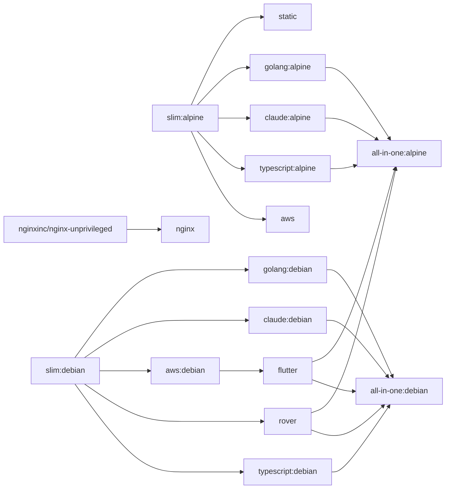

# Base Images

Hardened, multi-arch Docker base images for the pyck.ai platform. All images are published to `ghcr.io/pyck-ai/baseimages/` and support `linux/amd64` and `linux/arm64`.

## Images

| Image | Description | Docs |
|-------|-------------|------|
| `slim:alpine` | Hardened Alpine slim with common tooling | [docker/slim](docker/slim/README.md) |
| `slim:debian` | Hardened Debian slim with common tooling | [docker/slim](docker/slim/README.md) |
| `static` | Minimal scratch image for static binaries | [docker/static](docker/static/README.md) |
| `golang:latest` | Go toolchain + CI tools (Alpine variant) | [docker/golang](docker/golang/README.md) |
| `golang:debian` | Go toolchain + CI tools (Debian variant) | [docker/golang](docker/golang/README.md) |
| `nginx` | Unprivileged nginx for SPAs with OTel support | [docker/nginx](docker/nginx/README.md) |
| `claude:latest` | Claude Code CLI for agent pipelines (Alpine) | [docker/claude](docker/claude/README.md) |
| `claude:debian` | Claude Code CLI for agent pipelines (Debian) | [docker/claude](docker/claude/README.md) |
| `flutter` | Flutter + Dart runtime with RFW validator | [docker/flutter](docker/flutter/README.md) |
| `typescript:latest` | TypeScript/JS runtime powered by Bun (Alpine) | [docker/typescript](docker/typescript/README.md) |
| `typescript:debian` | TypeScript/JS runtime powered by Bun (Debian) | [docker/typescript](docker/typescript/README.md) |
| `rover` | Apollo Rover CLI for schema registry and supergraph operations | [docker/rover](docker/rover/README.md) |
| `aws:latest` | AWS CLI (Alpine) | [docker/aws](docker/aws/README.md) |
| `aws:debian` | AWS CLI (Debian) — base for the flutter image | [docker/aws](docker/aws/README.md) |
| `all-in-one:alpine` | Full toolset in a single Alpine image | [docker/all-in-one](docker/all-in-one/README.md) |
| `all-in-one:debian` | Full toolset in a single Debian image | [docker/all-in-one](docker/all-in-one/README.md) |

## Dependency graph



## Versioning

All tool and base image versions are pinned in [`buildargs.conf`](buildargs.conf) and kept up to date by [Renovate](https://docs.renovatebot.com/).

## Building

### Prerequisites

```sh
task setup    # create the buildx builder (once)
```

### Build all images

```sh
task build
```

### Build a specific group or target

```sh
task build -- slim              # alpine + debian slim images
task build -- static            # scratch/static image
task build -- golang            # both golang variants
task build -- nginx             # nginx SPA image
task build -- claude            # Claude Code CLI image
task build -- flutter           # Flutter + Dart image
task build -- typescript        # TypeScript/Bun image (both variants)
task build -- rover             # Apollo Rover CLI image
task build -- aws               # AWS CLI image
task build -- all-in-one        # all-in-one image (both variants)
task build -- slim-alpine       # alpine slim only
task build -- golang-alpine     # Go alpine only
```

### Build a specific arch only

```sh
task build ARCH=amd64 -- slim-alpine
```

## Repository layout

```
buildargs.conf        # pinned versions for all tools and base images
docker-bake.hcl       # Docker Bake targets and tag definitions
docker/
  slim/               # Alpine and Debian slim images
  static/             # Scratch image for static binaries
  golang/             # Go toolchain images
  nginx/              # Unprivileged nginx for SPAs
  claude/             # Claude Code CLI
  flutter/            # Flutter + Dart runtime with RFW validator
  typescript/         # TypeScript/JS runtime (Bun)
  rover/              # Apollo Rover CLI
  aws/                # AWS CLI v2
  all-in-one/         # All-in-one image (Alpine + Debian)
Taskfile.yml          # build and test tasks
```
