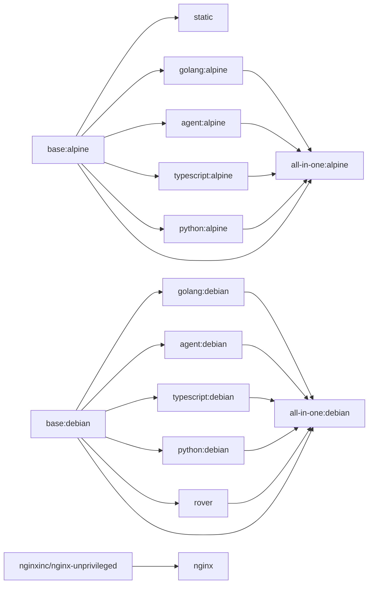

# Base Images

Hardened, multi-arch Docker base images for the pyck.ai platform. All images are published to `ghcr.io/pyck-ai/baseimages/` and support `linux/amd64` and `linux/arm64`.

## Images

The images fall into a few kinds:

- **Base** — a hardened Alpine + Debian foundation with common tooling. Other images may build on it, but single-purpose images are not required to.
- **Developer tooling** — single-purpose language toolchains, package managers, and coding-agent CLIs. Each targets one kind of project, and all are bundled into `all-in-one`.
- **All-in-one** — the full developer-tooling set in one image, for local development where juggling many images isn't worth it. Not intended for CI (size and attack surface).
- **Runtime & deployment** — single-purpose images that run or serve an application rather than build one. Consumed standalone and intentionally excluded from `all-in-one`.

### Conventions

Default `USER` follows the image's role:

| Role | Images | Default user | Nonroot escape hatch |
|------|--------|---------------|-----------------------|
| Build substrate / developer tooling | `base`, `golang`, `python`, `typescript`, `rover`, `agent`, `all-in-one` | `root` (uid 0) | `--user 1001` drops to the `nonroot` account; each image's tool dirs are nonroot-owned |
| Runtime / deployment | `nginx` (101), `static` (1001) | nonroot | `--user 0` elevates to root, e.g. to install packages or use the image as a build environment |

Build-substrate images default to root so they work as GitHub Actions job containers: GHA runs steps as the image's `USER`, and steps routinely install packages (apt/apk) and write outside the workspace — the same reason the official `golang`/`python` images default to root. The `nonroot` account is uid/gid **1001** to match the uid our runners execute as ([`deployment/Dockerfile.runner`](https://github.com/pyck-ai/deployment/blob/main/Dockerfile.runner)), so the bind-mounted workspace stays writable and `actions/checkout` (git "dubious ownership"), `$GITHUB_ENV` and `$GITHUB_OUTPUT` keep working whenever an image does run as nonroot. Runtime images keep nonroot for deployment security. `WORKDIR` is `/app` for the images that use it; see each image's README for exceptions (`static` uses `/home/nonroot`).

### Base

| Image | Description |
|-------|-------------|
| [`base`](docker/base/README.md) | Hardened Alpine + Debian foundation with common tooling; an optional base for the other images |

### Developer tooling

Single-purpose tooling images, all bundled into `all-in-one`.

| Image | Description |
|-------|-------------|
| [`agent`](docker/agent/README.md) | Claude Code + opencode + pi coding-agent CLIs |
| [`golang`](docker/golang/README.md) | Go toolchain + CI tools (delve, golangci-lint, gotestsum, go-arch-lint) |
| [`python`](docker/python/README.md) | Python runtime with uv + Ruff |
| [`rover`](docker/rover/README.md) | Apollo Rover CLI for schema registry and supergraph operations (Debian only) |
| [`typescript`](docker/typescript/README.md) | TypeScript/JS runtime powered by Bun |

### All-in-one

| Image | Description |
|-------|-------------|
| [`all-in-one`](docker/all-in-one/README.md) | Every developer-tooling image combined for local development; excludes the runtime & deployment images (nginx, static) |

### Runtime & deployment

Single-purpose, consumed standalone, and intentionally excluded from `all-in-one`.

| Image | Description |
|-------|-------------|
| [`nginx`](docker/nginx/README.md) | Unprivileged nginx for SPAs with OTel support |
| [`static`](docker/static/README.md) | Minimal scratch image for running static binaries |


## Deprecated tags

> [!WARNING]
> The images and tags below are **no longer built** and are **scheduled for
> removal without further announcement**. Migrate to the replacement — for the
> renamed repositories keep the tag and only change the name (e.g.
> `slim:alpine` → `base:alpine`).

| Deprecated | Replacement |
|------------|-------------|
| `slim` | `base` |
| `agents` | `agent` |
| `alpine:latest` | `all-in-one:alpine` |
| `debian:latest` | `all-in-one:debian` |
| `rover:debian` | `rover:latest` |
| `rover:<version>-debian` | `rover:<version>` |
| `flutter` | [`ghcr.io/pyck-ai/flutter-rfw`](https://github.com/pyck-ai/flutter-rfw) |

## Versioning

All tool and base image versions are pinned in [`buildargs.conf`](buildargs.conf) and kept up to date by [Renovate](https://docs.renovatebot.com/).

## Building

### Prerequisites

```sh
task setup    # create the buildx builder (once)
```

### Build all images

```sh
task build
```

### Build a specific group or target

```sh
task build -- static            # scratch/static image
task build -- base              # alpine + debian base images
task build -- base-alpine       # alpine base only
task build -- golang            # both golang variants
task build -- golang-debian     # Go debian only
task build -- all-in-one        # all-in-one image (both variants)
```

### Build a specific arch only

```sh
task build ARCH=amd64 -- base-alpine
```

## Verifying

`task verify` builds the images with `--load` and then runs each image's own
`docker/<image>/verify.sh` against the result. It takes the same target syntax as
`task build`:

```sh
task verify                     # every image
task verify -- golang           # both golang variants
task verify -- golang-alpine    # one target
```

This checks the *assembled* image rather than a build stage — default user, `WORKDIR`,
`ENV`, tool versions against [`buildargs.conf`](buildargs.conf), directory writability,
and a smoke test per image (`go build`, `bun add -g`, an RFW round-trip, an HTTP request
to nginx). It is distinct from `download.sh --verify`, which checks a tool inside the
stage that installed it; bugs that only appear once all the `COPY`s are stitched
together are invisible to the build and are what this catches.

Each image owns its checks; [`docker/verify-lib.sh`](docker/verify-lib.sh) provides the
shared helpers. Verification needs `--load`, so it runs against a single architecture.

## Dependency graph

The arrows show current build dependencies. Building on `base` is optional by design — a single-purpose image may start from any suitable upstream instead (e.g. `golang` also pulls the official `golang` toolchain image, `nginx` builds on `nginxinc/nginx-unprivileged`).


