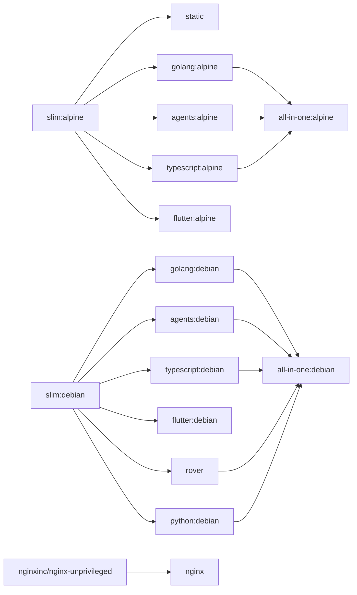

# Base Images

Hardened, multi-arch Docker base images for the pyck.ai platform. All images are published to `ghcr.io/pyck-ai/baseimages/` and support `linux/amd64` and `linux/arm64`.

## Images

| Image | Description |
|-------|-------------|
| [`agents`](docker/agents/README.md) | Claude Code + opencode CLIs for agent pipelines |
| [`all-in-one`](docker/all-in-one/README.md) | Full toolset in a single image |
| [`flutter`](docker/flutter/README.md) | Flutter + Dart runtime with RFW validator |
| [`golang`](docker/golang/README.md) | Go toolchain + CI tools |
| [`nginx`](docker/nginx/README.md) | Unprivileged nginx for SPAs with OTel support |
| [`python`](docker/python/README.md) | Python runtime with uv + Ruff |
| [`rover`](docker/rover/README.md) | Apollo Rover CLI for schema registry and supergraph operations |
| [`slim`](docker/slim/README.md) | Hardened slim base with common tooling |
| [`static`](docker/static/README.md) | Minimal scratch image for static binaries |
| [`typescript`](docker/typescript/README.md) | TypeScript/JS runtime powered by Bun |


## Versioning

All tool and base image versions are pinned in [`buildargs.conf`](buildargs.conf) and kept up to date by [Renovate](https://docs.renovatebot.com/).

## Building

### Prerequisites

```sh
task setup    # create the buildx builder (once)
```

### Build all images

```sh
task build
```

### Build a specific group or target

```sh
task build -- static            # scratch/static image
task build -- slim              # alpine + debian slim images
task build -- slim-alpine       # alpine slim only
task build -- golang            # both golang variants
task build -- golang-debian     # Go debian only
task build -- all-in-one        # all-in-one image (both variants)
```

### Build a specific arch only

```sh
task build ARCH=amd64 -- slim-alpine
```

## Dependency graph


