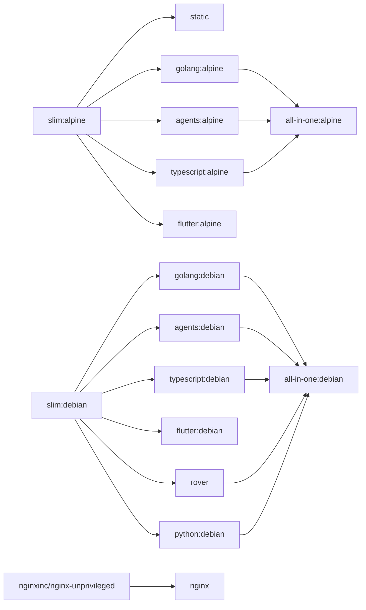

# Base Images

Hardened, multi-arch Docker base images for the pyck.ai platform. All images are published to `ghcr.io/pyck-ai/baseimages/` and support `linux/amd64` and `linux/arm64`.

## Images

| Image | Description | Docs |
|-------|-------------|------|
| `slim:alpine` | Hardened Alpine slim with common tooling | [docker/slim](docker/slim/README.md) |
| `slim:debian` | Hardened Debian slim with common tooling | [docker/slim](docker/slim/README.md) |
| `static` | Minimal scratch image for static binaries | [docker/static](docker/static/README.md) |
| `golang:latest` | Go toolchain + CI tools (Alpine variant) | [docker/golang](docker/golang/README.md) |
| `golang:debian` | Go toolchain + CI tools (Debian variant) | [docker/golang](docker/golang/README.md) |
| `nginx` | Unprivileged nginx for SPAs with OTel support | [docker/nginx](docker/nginx/README.md) |
| `agents:latest` | Claude Code + opencode CLIs for agent pipelines (Alpine) | [docker/agents](docker/agents/README.md) |
| `agents:debian` | Claude Code + opencode CLIs for agent pipelines (Debian) | [docker/agents](docker/agents/README.md) |
| `flutter` | Flutter + Dart runtime with RFW validator | [docker/flutter](docker/flutter/README.md) |
| `typescript:latest` | TypeScript/JS runtime powered by Bun (Alpine) | [docker/typescript](docker/typescript/README.md) |
| `typescript:debian` | TypeScript/JS runtime powered by Bun (Debian) | [docker/typescript](docker/typescript/README.md) |
| `rover` | Apollo Rover CLI for schema registry and supergraph operations | [docker/rover](docker/rover/README.md) |
| `python` | Python runtime with uv + Ruff (Debian only) | [docker/python](docker/python/README.md) |
| `all-in-one:alpine` | Full toolset in a single Alpine image | [docker/all-in-one](docker/all-in-one/README.md) |
| `all-in-one:debian` | Full toolset in a single Debian image | [docker/all-in-one](docker/all-in-one/README.md) |


## Versioning

All tool and base image versions are pinned in [`buildargs.conf`](buildargs.conf) and kept up to date by [Renovate](https://docs.renovatebot.com/).

## Building

### Prerequisites

```sh
task setup    # create the buildx builder (once)
```

### Build all images

```sh
task build
```

### Build a specific group or target

```sh
task build -- static            # scratch/static image
task build -- slim              # alpine + debian slim images
task build -- slim-alpine       # alpine slim only
task build -- golang            # both golang variants
task build -- golang-debian     # Go debian only
task build -- all-in-one        # all-in-one image (both variants)
```

### Build a specific arch only

```sh
task build ARCH=amd64 -- slim-alpine
```

## Dependency graph


